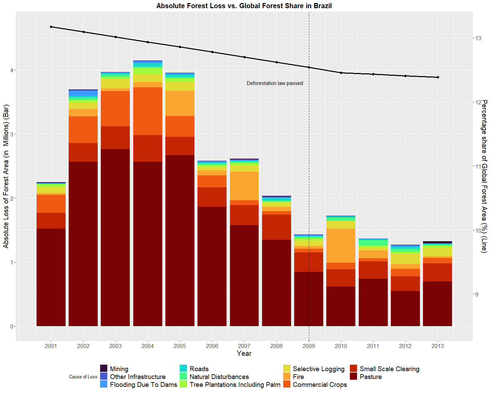

DSA2101 Group Project: Deforestation
================
Ethan Cheung, Wilfred Woo, She Chee Yee, Hoo Fang Yu, Merson Cheong
2023-04-14

# Introduction

This dataset contains relevant data with regards to deforestation,
showing the yearly changes in forest areas within each country, and the
country’s forest area as a proportion of the global forest area. The
causes of deforestation were also raised, with factors specific to
Brazil being introduced, and a potential large source of deforestation
(soybean) was shown. The dataset has 4 components, with the descriptions
as follows:

1.  Forest (*forest.csv*) This dataset covers the net forest conversion
    in hectares yearly for each country.

2.  Forest Area (*forest_area.csv*) This shows countries’ forest area as
    a percentage of global forest area yearly.

3.  Brazil Loss (*brazil_loss.csv*) The absolute loss in Brazilian
    forest areas as a result of the causes mentioned in the dataset.

4.  Soybean Use (*soybean_use.csv*) Soybean production and use by
    countries by year.

5.  Vegetable Oil Production (*vegetable_oil.csv*) Vegetable oil
    production by crop type and year.

``` r
#install.packages("gghighlight")
#install.packages("ggpubr")
#install.packages("gridExtra")
#install.packages("ggthemes")

library(tidyr)
library(ggpubr)
library(ggplot2)
library(tidyverse)
library(gghighlight)
library(grid)
library(viridis)
library(maps)
library(ggthemes)


tuesdata <- tidytuesdayR::tt_load('2021-04-06')
## 
##  Downloading file 1 of 5: `forest.csv`
##  Downloading file 2 of 5: `forest_area.csv`
##  Downloading file 3 of 5: `brazil_loss.csv`
##  Downloading file 4 of 5: `soybean_use.csv`
##  Downloading file 5 of 5: `vegetable_oil.csv`

forest = tuesdata$forest
forest_area = tuesdata$forest_area
brazil_loss = tuesdata$brazil_loss
soybean_use = tuesdata$soybean_use
vegetable_oil = tuesdata$vegetable_oil
```

# *Descriptive statistics*

On inspection of the dataset prior to further analysis, we noted two
main observations with regards to the structure of the dataset:

Problem 1: Lack of representation With causes of deforestation being
exclusively reflected for Brazil, analysis for the causes of
deforestation is an issue. As such, to avoid this issue, the use of
`inner_join()` function to form a combined variable was done to analyse
the causes of deforestation specifically from Brazil to investigate the
impact of changes of the Brazilian Deforestation Rate on the Global
Forest Area.

Problem 2: Uneven Time Intervals With not all years within the Forest
dataset being reflected for every country, the overall analysis as the
yearly changes cannot be accurately reflected since the years which are
not represented may vary from expected due to unexpected events.
Therefore, the removal of the Forest dataset from analysis was done due
to the potential inaccuracy that it could bring to our analysis.

``` r
forest_area_brazil = forest_area %>%
  filter(code == "BRA", year >= 2001, year <= 2013) 

combined = forest_area_brazil %>%
  inner_join(brazil_loss, by = c("entity", "code", "year"))
```

# Question 1: Can changes in Brazilian Deforestation Rate affect the Global Forest Area?

## Introduction

This question addresses the impact of Brazil’s deforestation (man-made
and natural) on the percentage of Brazil’s forest in the global forest
area. This question piqued our curiosity as the changes in global forest
area could be attributed to 2 factors: deforestation and reforestation.
Therefore, we are interested to see how deforestation occurs, while also
understanding whether deforestation specifically in Brazil can be
controlled. To answer this question, we will be using the *forest_area*
and *brazil_loss* dataset. In the processing of the data, we first
filtered the *forest_area* dataset to obtain all forest loss for Brazil
from the year 2001 to 2013 and used inner_join() to combine this
filtered dataset with *brazil_loss* to see the impact of various factors
on Brazil’s forest loss, saving this combined dataset as *combined*. We
then use pivot_longer() to obtain the dataset in a tidy format, saving
this new dataset as *combinedv2*. We can then use ggplot to show our
visualisations.

## Methodology

The visualisations are as follow:

Firstly, prior to finding out the impact on global forest area, we first
plot a line graph to analyse the impact of various factors on Brazil’s
forest area loss, with each line distinguished by colour, and each line
representing the factor’s contribution to deforestation.

In the other visualisation, a stacked barplot is then used to represent
the absolute loss of forest area in Brazil. On the same plot, a line
graph is plotted to show the percentage share of Global Forest Area. We
plotted both in order to see a potential relation between Brazil’s
changing forest area loss and Brazil’s percentage share of the Global
Forest Area.

## Visualizations

``` r
combinedv2 = combined %>%
  pivot_longer(commercial_crops:small_scale_clearing, names_to = "Types", values_to = "contribution" ) %>%
  mutate(Types = str_to_title(str_replace_all(Types, "_", " "))) %>%
  mutate(Types = reorder(Types, contribution))

combinedv3 = combinedv2 %>%
  filter(year == 2013, Types %in% c("Pasture","Small Scale Clearing", "Commercial Crops", "Fire"))
```

### Plot 1.1

``` r
ggplot(combinedv2, aes(color = Types, x = year, y = contribution/10**6)) + 
  geom_line(size = 1.2, show.legend = FALSE) +
  geom_point(size = 2, show.legend = FALSE) +
  scale_x_continuous(breaks = 2001:2014, limits = c(2001,2016))+
  labs(title = "Contribution to Deforestation by Types from 2001 to 2013", x = "Year", y = "Loss of Forest (in Millions)" ) +
  theme(axis.text=element_text(size=12),
        axis.title=element_text(size=15), plot.title = element_text(hjust = 0.5, size = 15, face = "bold")) +
  gghighlight(Types %in% c("Pasture","Small Scale Clearing", "Commercial Crops", "Fire"), use_direct_label = FALSE) +
  geom_text(data = combinedv3, aes(label = Types), hjust = "left", nudge_x = 0.1, size = 3.5, show.legend = FALSE) +
  scale_color_manual(values = c("Pasture" = "#654321", "Small Scale Clearing" = "deepskyblue4", "Commercial Crops" = "darkgreen", "Fire" = "red"))
```

<!-- -->

### Plot 1.2

``` r
ggplot(combinedv2) +
  geom_col(aes(fill = Types, x = year, y = contribution/10**6)) +
  scale_x_continuous(breaks = 2001:2013) +
  labs(fill = "Cause of Loss",title = "Absolute Forest Loss vs. Global Forest Share in Brazil", x = "Year", y = "Absolute Loss of Forest Area (in  Millions) (Bar)" ) +
  theme(axis.text=element_text(size=12),
        axis.title=element_text(size=15), plot.title = element_text(hjust = 0.5, size = 15, face = "bold"), legend.position = "bottom", legend.text = element_text(size = 14), legend.title = element_text(size = 10)) +
  scale_fill_viridis(discrete = T, option = "turbo") + 
  geom_line(aes(x=year,y=(forest_area-8.5)), linewidth = 1.2) +
  geom_point(aes(x=year,y=(forest_area-8.5)), size = 2)+
  scale_y_continuous(sec.axis = sec_axis(~.+8.5, name="Percentage share of Global Forest Area (%) (Line)")) + 
  geom_vline(xintercept = 2009, linetype = "dashed") +
  annotate("text", x = 2009, y = 3.8, label = "Deforestation law passed", hjust =1.1)
```

<!-- -->

## Discussions

Firstly, on analysis of the first plot, we observed that the pasture
variable was consistently largely responsible for the Loss in Forest
Area throughout the time period from 2001 to 2013. However, from 2005
onwards, it was observed to see a sharp drop in its contribution to the
loss in forest where it largely achieved a close to constant yearly
contribution to forest area. Within the visualisation, we identified
four main factors driving this loss in forest: Pasture, Small Scale
Clearing, Commercial Crops, and Fire. While the factors apart from
Pastures are approximately constant, the Fire variable fluctuates every
few years as this is largely due to natural causes, while the remaining
factors (including Pastures) are man-made. Therefore, it can be
concluded that deforestation in Brazil can be controlled and minimised
since it is largely man-driven.

Next, from the second plot, we gathered that there is a weak
relationship between Brazil’s deforestation rate and Brazil’s share of
the Global Forest Area. This is seen by the sharp rise in loss of forest
area from 2001 to 2002 and sharp drop from 2005 to 2006 not being
reflected in Brazil’s percentage share of the Global Forest Area line
graph in the first place which only shows an approximately constant
gradient from 2001 to 2010. As such, deforestation may be outweighed by
reforestation efforts (BioCarbon Project, n.d.), and hence raising
deforestation rates may not contribute significantly to the percentage
of Global Forest Area taken up by Brazil. However, in the recent years
from 2010 to 2013, it does reflect a slight similarity where when the
loss of forest area began to slow down, so did Brazil’s fall in share of
Global Forest Area. This is reflective of the law passed in 2009 by the
Brazilian government to cut greenhouse emissions (Secom, 2010). With
legislation to minimise greenhouse gases (reducing deforestation in the
process), the loss of forest area is as expected, and the line graph
following suit, there could be an insight that prior to 2010, the
relationship was weak, but in more recent years, the trend could be
slightly more reflective of a direct relationship between the absolute
loss of Brazilian forest area and its percentage share of the Global
Forest Area. This conclusion can only be confirmed with further data in
recent years being provided. However, based on the data provided, it
does appear that changes in the Brazilian Deforestation Rate could have
a significant impact on the Global Forest Area and even complement the
reforestation efforts by other countries.

# Question 2: Are there any patterns regarding the trend of oil production from 1960?

## Introduction

Here, we dive deeper in the trend of oil production across the years.
From within, we see if there are any patterns and what could be some
possible reaons for this.

For plot 2.1, we first had to clean the datasets by replacing all NAs
with 0, to represent no production with an actual value. For the left
plot which is focusing on vegetable oil, in order to visualize the
market share of each oil, we created a share column to represent the
market share of each oil in %. The graph is then plotted out using a
bubble plot, with the size showing the production in tonnes, y-axis
showing the market share of each oil (%) and x-axis being the year.

For the right plot which focuses on soybean usage, we simply added up
the columns contributing to non-edible and edible purpose respectively,
and plotted it out using `geom_area` to show the growth of edible and
non_edible usage, as well as to provide a visual comparison of the
growth rate between the 2 usages.

For plot 2.2, we first isolate the top four produced oils (determined
from plot 2.1) from vegetable_oils, and spread each of these out as
columns. We plot each oil separately, rather than using `facet_wrap()`,
to be able to represent each oil with a different colour to reduce
confusion. We also merge the dataset with “world” map data from ggplot2
to be able to represent production as gradients on a map.

## Methodology

In plot 2.1, we used a combination of a bubble and scatter plot. The
size of the bubble shows the production of oil in raw numbers while the
scatter points show the share of the oil as a percentage of the world’s
total production of oil during a specific year. To keep things simple,
we leveraged `gghighlight` to place emphasis on the top four oils in
terms of global oil share. From this, we can easily see the general
increase in oil production across all oils through the increasing bubble
size as well as simultaneously keep track of the world’s leading share
of oil. On the right, we take a deeper dive into the usage of Soybean
oil. Using a fill plot, we aim to showcase the increasing disparity of
share of soybean oil being allocated for edible and nonedible sources
while still providing information with regards to the amount being
produced. This provides us with deeper information with regards to the
increase in oil production as shown on the left.

For plot 2.2, we present production of each of the top four produced
vegetable oils as a world map, faceted in a 2x2 grid for easy
comparison. In each map, we used increasing fill saturation within each
country to show increasing levels of production of the crop oil,
according to a logarithmic scale for higher contrast between producing
and non-producing regions. This is useful in showing distribution of
production levels across geographical regions, which we hope to observe
some trend from. The visualisation depicts production only in 2014,
which is the most recent year in which all countries that have been
producing in the previous five years, have non-missing values for.

## Visualizations

### Plot 2.1

``` r
vegetable_oil_1 = vegetable_oil %>% 
  mutate_at(vars(production), ~replace(., is.na(.), 0)) %>%
  filter(str_length(code) == 3)

soybean_use = soybean_use %>%
  mutate_at(vars(human_food:processed), ~replace(., is.na(.), 0)) %>%
  filter(str_length(code) == 3)

plot1 = vegetable_oil_1 %>%
  group_by(year, crop_oil) %>%
  summarize(total = sum(production)/1000000) %>%
  group_by(year) %>%
  mutate(year_total = sum(total),
         share = (total/year_total) * 100) %>%
  ungroup() %>%
  mutate(crop_oil = factor(crop_oil ,levels = c("Palm","Soybean", "Rapeseed","Sunflower",
                                        "Groundnut", "Cottonseed", "Maize", "Olive, virgin", "Coconut (copra)", "Sesame",
                                        "Safflower", "Linseed"))) %>%
  arrange(desc(total)) %>%
  filter(crop_oil != "Palm kernel") %>%
  ggplot(aes(year, share, size = total, color = crop_oil)) + 
  geom_point(alpha = 0.5) +
  scale_size(range = c(.1, 15), name = "Total production\n(million tonnes)") +
  labs(y="Share of production (%)") +
  guides(color= guide_legend("Types of Oil", override.aes = list(size = 5))) +
  scale_color_manual(values = c("Soybean" = "#0077be", "Rapeseed" = "#FFA500", "Sunflower" = "#800080", "Palm" = "darkgreen")) +
  labs(title = "Historical production of different edible-oils") +
  theme(axis.text=element_text(size=12), axis.title=element_text(size=15),
        legend.position = "right", legend.text = element_text(size = 14), legend.title = element_text(size = 14),
        plot.title = element_text(hjust = 0.5, size = 15, face = "bold"))

plot2 = soybean_use %>%
  group_by(year) %>%
  summarize(edible = sum(human_food),
            non_edible = sum(animal_feed) + sum(processed)) %>%
  ungroup() %>%
  gather(edible:non_edible, key = "types", value = "production") %>% 
  arrange(year) %>%
  mutate(types = factor(types, levels=c("non_edible", "edible"))) %>%
  ggplot(aes(year, production, fill = types)) + 
  geom_area(alpha = 1, linetype = "solid") +
  scale_y_continuous(label = scales:: comma) +
  labs(y = "Production in tonnes", title = "Historical soybean production (1961-2014)") + 
  theme(axis.text=element_text(size=12), axis.title=element_text(size=15),
        legend.position = c(0.15,0.85), legend.box.just = "left", 
        legend.text = element_text(size = 14), legend.title = element_text(size = 14),
        plot.title = element_text(hjust = 0.5, size = 15, face = "bold"))
        # legend.justification =c(0,1),
        # legend.margin = margin(-10,0,0,0))


# options(scipen=999)
ggarrange(plot1, plot2,  nrow = 1, heights = c(1,2), common.legend = FALSE,
          widths = c(1.5,1))
```

<!-- -->

### Plot 2.2

``` r
veg_2 = vegetable_oil %>% 
  filter(str_length(code) ==3, (year==2014), crop_oil %in% c("Palm", "Soybean", "Rapeseed", "Sunflower")) %>%
  mutate_at(vars(production), ~replace(., is.na(.), 1)) %>% 
  spread(crop_oil, production)
country_codes = veg_2 %>% select(code) %>% distinct()

countries = country_codes %>% left_join(iso3166, by = c(code = "a3")) %>% 
  mutate(mapname = ifelse(mapname == "UK(?!r)", "UK", mapname), 
         mapname = ifelse(mapname == "Norway(?!:Bouvet|:Svalbard|:Jan Mayen)",
                          "Norway", mapname),
         mapname = ifelse(mapname == "Finland(?!:Aland)", "Finland", mapname))

world_map = map_data("world") %>% as_tibble() %>% left_join(countries, by = c(region= "mapname")) %>%
  left_join(veg_2, by = "code") %>% filter(region != "Antarctica") %>%
  mutate_at(vars(Palm, Rapeseed, Soybean, Sunflower), ~replace(., is.na(.), 1))

plot2_5 = ggplot(world_map, aes(x = long, y = lat, group = group)) +
  geom_polygon(aes(fill = log10(Palm)), color = "black", linewidth = 0.05) +
  theme_map() +
  scale_fill_distiller(name = "Production (Tonnes)", 
                       palette = "Greens", trans = "reverse",
                       breaks = c(0, 2, 4, 6), 
                       labels = label_parsed(c("10^0", "10^2", "10^4", "10^6"))) +
  labs(title = "Production of Palm Oil in 2014") +
  theme(plot.title = element_text(size = 12),
        legend.text = element_text(size = 12), legend.title = element_text(size = 12))


plot2_6 = ggplot(world_map, aes(x = long, y = lat, group = group)) +
  geom_polygon(aes(fill = log10(Rapeseed)), color = "black", linewidth = 0.05) +
  theme_map() +
  scale_fill_distiller(name = "Production (Tonnes)", 
                       palette = "Oranges", 
                       trans = "reverse",
                       breaks = c(0, 2, 4, 6), 
                       labels = label_parsed(c("10^0", "10^2", "10^4", "10^6")))+
  labs(title = "Production of Rapeseed Oil in 2014") +
  theme(plot.title = element_text(size = 12),
        legend.text = element_text(size = 12), legend.title = element_text(size = 12))


plot2_7 = ggplot(world_map, aes(x = long, y = lat, group = group)) +
  geom_polygon(aes(fill = log10(Soybean)), color = "black", linewidth = 0.05) +
  theme_map() +
  scale_fill_distiller(name = "Production (Tonnes)", 
                       palette = "Blues", 
                       trans = "reverse", 
                       breaks = c(0, 2, 4, 6), 
                       labels = label_parsed(c("10^0", "10^2", "10^4", "10^6"))) +
  labs(title = "Production of Soybean Oil in 2014") +
  theme(plot.title = element_text(size = 12),
        legend.text = element_text(size = 12), legend.title = element_text(size = 12))

plot2_8 = ggplot(world_map, aes(x = long, y = lat, group = group)) +
  geom_polygon(aes(fill = log10(Sunflower)), color = "black", linewidth = 0.05) +
  theme_map() +
  scale_fill_distiller(name = "Production (Tonnes)", 
                       palette = "Purples", 
                       trans = "reverse",
                       breaks = c(0, 2, 4, 6), 
                       labels = label_parsed(c("10^0", "10^2", "10^4", "10^6")))+
  labs(title = "Production of Sunflower Oil in 2014") +
  theme(plot.title = element_text(size = 12),
        legend.text = element_text(size = 12), legend.title = element_text(size = 12))

plot_final = ggarrange(plot2_5, plot2_6, plot2_7, plot2_8,  nrow = 2, ncol =2, 
          common.legend = FALSE, legend = "right")

annotate_figure(plot_final, top = text_grob("Where are different top produced oils made?", 
               color = "Black", face = "bold", size = 15))
```

<!-- -->

## Discussions

Palm oil has emerged as the largest contributor to the world’s total oil
production, surpassing soybean. The preference for palm oil in the food
industry may be due to its lower cost (Liu, E. 2019, November 21) ,
which could help manufacturers lower their overall production costs. In
contrast, soybean production has largely been diverted towards
non-edible purposes in recent years. It is worth noting that the top
four oils can be used for both edible and non-edible purposes. The high
versatility of these oils may be the reason for their high levels of
production. Regional demand and production areas may also play a role in
determining the popularity of different types of oils, hence it is worth
exploring where each of these four oils are produced.

Exploring the world maps for the production of palm oil in plot 2.2, we
notice that despite palm oil being the highest produced vegetable oil,
it is produced in few countries, particularly those nearer to the
equator. Comparing palm oil production regions to the production regions
of the other three top produced oils, we see that the other three crops
have more countries that produce it. This is especially apparent for
soybean, which has a relatively even distribution across geographical
regions (except for Africa). This could show that while palm oil grows
best with specific climate requirements, the other crops grow well in a
wider range of climates, and this could be a reason for their global
popularity. The fact that palm oil is able to occupy the highest share
of oil in the world despite having few places that produce it emphasizes
its utility and demand.

Comparing the regions that produce palm oil and soybean oil, we observe
that many countries that produce palm oil also produce soybean oil, but
the converse is not true. This could mean that regions that have the
supply of palm oil also have soybean oil. Hence, this could mean that
the regional demand would influence in the choice of oil usage, that is
allocation of oil into non edible or edible sources is based on what is
widely consumed within the region. Furthermore, using plot 2.2, we can
see that rapeseed oil is seen to be majorly produced within Europe and
sunflower oil production is concentrated in the Russia and Ukraine
areas. Other than being one of the top producers, these regions are one
of the top consumers of these oils. (Statista 2021 & NationMaster 2020)
This could imply that the production of oil within an area is influenced
by the local demand for them. Conclusively, local demand could be a
possible driving factor for the production as well as usage of oil.

# References:

- R for Data Science Community. (2021, April 6). TidyTuesday Week
  14, 2021. GitHub.
  <https://github.com/rfordatascience/tidytuesday/blob/master/data/2021/2021-04-06/readme.md>

- BioCarbon Fund. (n.d.). Brazil: AES Tietê Afforestation/Reforestation
  Project in the State of São Paulo. Retrieved April 11, 2023, from
  <https://www.biocarbonfund.org/node/48>

- Secom. (2018, June 30). Brazil 2010 Amazon Deforestation Data Shows
  Lowest Rate Ever Recorded. PR Newswire.
  <https://www.prnewswire.com/news-releases/brazil-2010-amazon-deforestation-data-shows-lowest-rate-ever-recorded-111118084.html>

- NationMaster. (n.d.). Domestic Consumption of Sunflower Seed Oil.
  Retrieved April 12, 2023, from
  <https://www.nationmaster.com/nmx/ranking/domestic-consumption-of-sunflower-seed-oil>

- Statista. (2021). Domestic consumption of rapeseed oil worldwide in
  2020/21, by country (in 1,000 metric tons). Retrieved April 12, 2023,
  from
  <https://www.statista.com/statistics/1199472/domestic-consumption-of-rapeseed-oil-worldwide-by-country/>

- Liu, E. (2019, November 21). Palm oil is the world’s most popular
  vegetable oil. Here’s why it’s so cheap and how it’s destroying the
  planet. Business Insider.
  <https://www.businessinsider.com/why-palm-oil-is-so-cheap-2019-11#text=Palm%20oil%20is%20so%20efficient,the%20oil%20is%20so%20cheap>
